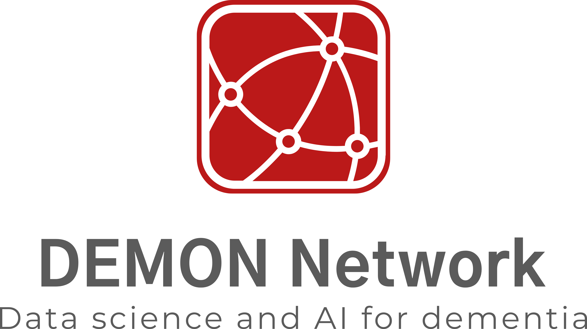

<!-- PROJECT LOGO -->
 

  

<h3 align="center">Reproducible Reporting using Markdown</h3>

  

    This workshop was a collaboration between the DEMON Network and the UK Reproducibility Network (UKRN), held virtually via zoom on 27/07/21.
     
    Contributers: Cameron Shand, DEMON Network, UKRN
     
  

<!-- TABLE OF CONTENTS -->

  
Table of Contents

  <ol>
    <li>
      <a href="#about-the-project">About The Workshop</a>
      <ul>
        <li><a href="#quick-description">Quick Description</a></li>
        <li><a href="#background/motivation">Background/motivation</a></li>
        <li><a href="#workflow-summary">Workflow Summary</a></li>
      </ul>
    </li>
    <li>
      <a href="#getting-started">Getting Started</a>
      <ul>
        <li><a href="#prerequisites">Prerequisites</a></li>
        <li><a href="#installation">Installation</a></li>
      </ul>
    </li>
    <li><a href="#usage">Usage</a></li>
    <li><a href="#acknowledgments">Acknowledgments</a></li>
  </ol>

